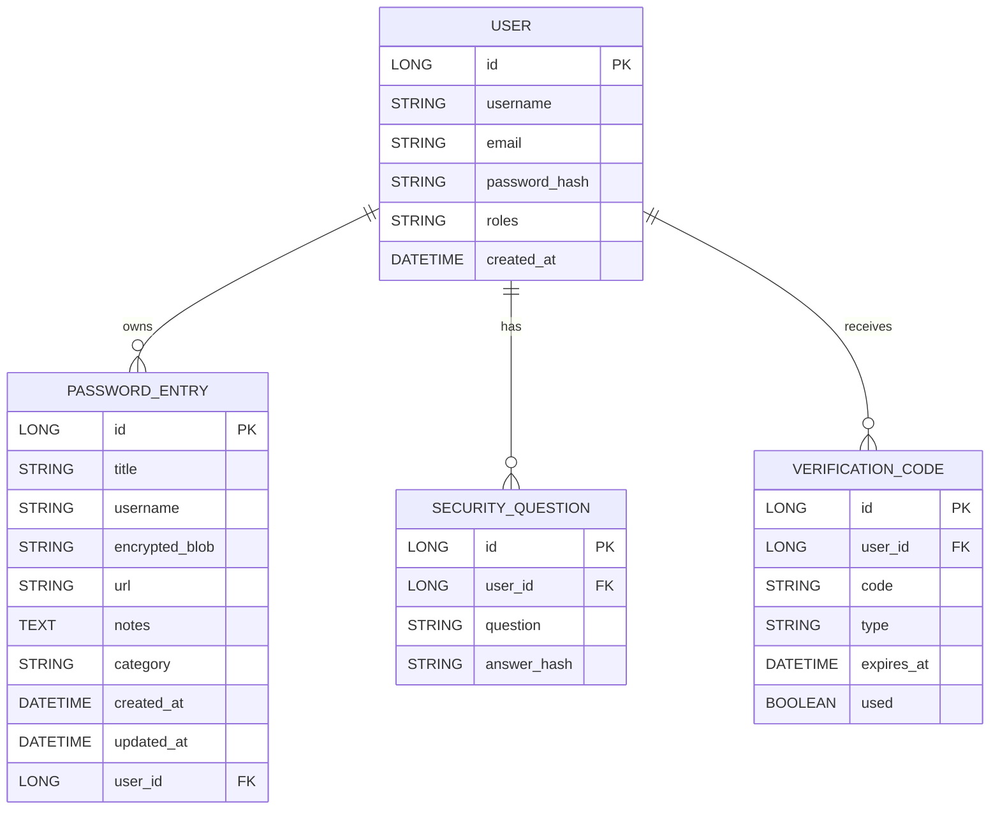

## ER Diagram

The following Mermaid ER diagram represents the canonical data model after cleaning duplicate source trees.

Notes:
- `PASSWORD_ENTRY.encrypted_blob` stores a per-entry salt (16B) and IV (12B) plus AES-GCM ciphertext (base64-encoded). The app derives the AES key using PBKDF2 with the per-entry salt and the user's master password.
- The canonical source tree is `src/` (top-level). Duplicate `password_manager/src/` was removed during cleanup.
- Production DB: MySQL (configured in `application.properties`); tests use H2 in-memory.

Save this file in the `docs/` folder and render with any Mermaid-compatible viewer (GitHub supports Mermaid in Markdown rendering).
