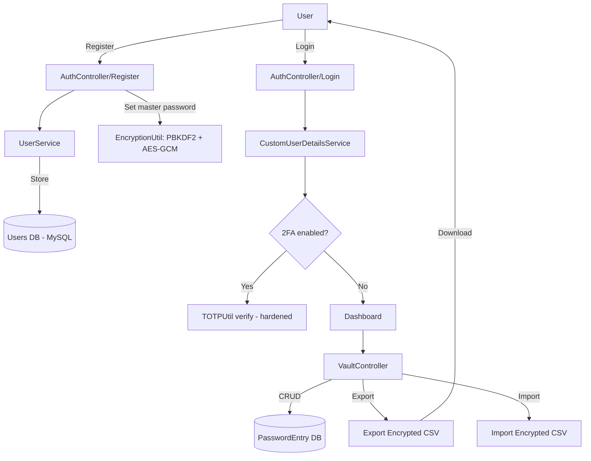

## Project Flow & Component Overview

Below is a high-level flow of the main user journeys and the key components that implement them (updated to reflect canonical `src/` structure and hardening changes).

### Key components (delta from previous)
- **AuthController**: registration/login/forgot/reset flows; uses `UserService` and `EmailService`.
- **UserService**: handles user creation, master-password handling, security questions, 2FA enable/disable.
- **TOTPUtil**: TOTP generation and verification — emergency bypass removed and verification window reduced.
- **EncryptionUtil**: encrypt/decrypt vault entries using per-entry salt + AES-GCM; `app.encryption.secret` is required but should be provided via environment or secret manager for production.
- **VaultController / VaultService**: CRUD for `PasswordEntry`; uses `EncryptionUtil` to encrypt/decrypt secrets with the user's master password.
- **Persistence**: Production configured for MySQL; tests run with H2 in-memory.

Notes:
- Duplicate `password_manager/src/` subtree was removed; canonical code lives in `src/` at the repository root.
- Secrets currently in `src/main/resources/application.properties` should be moved to environment variables before public or production use.

I can also render and commit PNG/SVG exports of these Mermaid diagrams if you want image assets in `docs/`.
